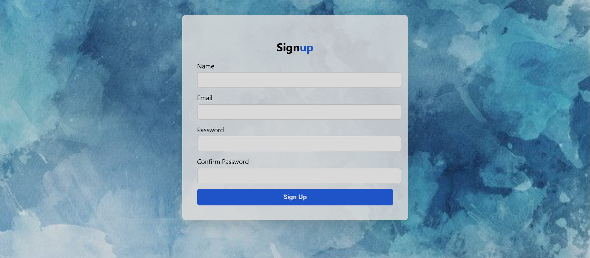

# 📝 Form Validator  

A beginner-friendly **Signup Form Validator** project that checks user inputs for:  
✅ Valid Name  
✅ Valid Email  
✅ Password length (minimum 6 characters)  
✅ Matching Confirm Password  

This project shows **error messages below each input field** if something is wrong.  

---

## 📂 Folder Structure  

form-validator/
│ 
├── index.html # Main HTML file (form structure) 
├── style.css # CSS file (design & styling) 
└── script.js # JavaScript file (validation logic)

---

## 🖼️ Preview  

---

## 🚀 Features  

- Real-time input validation  
- Custom error messages  
- Clean UI with modern design  
- Fully responsive form  

---

## 🛠️ Tech Stack  

- **HTML** – For structure  
- **CSS** – For styling  
- **JavaScript** – For validation logic  

---

## ⚡ How to Run  

1. **Download or clone** this repository  
2. Open `index.html` in your browser (or use **Live Server** in VS Code)  
3. Fill the form & click **Sign Up**  
4. Errors will appear below each field if validation fails  

---

## 🎯 Future Improvements  

- ✅ Add password strength indicator  
- ✅ Add real-time validation (while typing)  
- ✅ Integrate with backend (Python/Flask/Django) to actually store data  

---

👨‍💻 **Made with ❤️ while learning HTML, CSS, and JavaScript**
